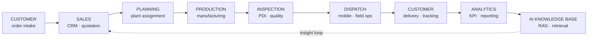
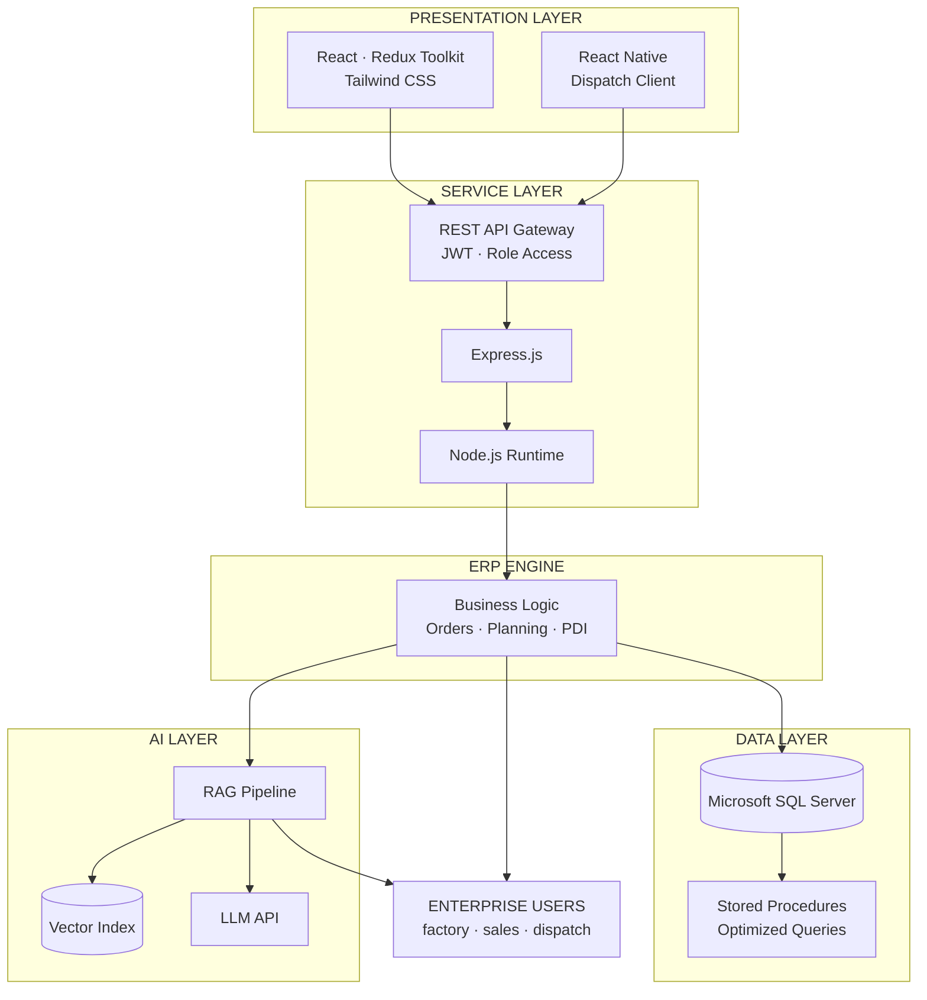
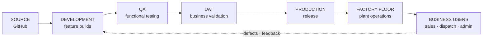

<!-- ══════════════════════════════════════════════════════════════
     KAJA MOIDEEN M K · ERP CONTROL CENTER
     IMPORTANT: blank lines in this file are REQUIRED.
     Markdown inside <td>/<div> only renders when separated by
     blank lines. Copy this file directly — never paste through
     a chat window or editor that strips empty lines.
     ══════════════════════════════════════════════════════════════ -->

<div align="center">


# KAJA MOIDEEN M K

**React.js & Node.js Developer — AI Engineer**

`TVS Sundaram Industries Pvt Ltd` · `Chennai, India` · `Enterprise Applications`

<br/>


<br/>

[](https://git.io/typing-svg)


</div>

<table width="100%">
<tr>
<td align="center" width="20%"><sub><b>OPERATOR</b></sub><br/><b>Kaja Moideen M K</b></td>
<td align="center" width="20%"><sub><b>ORGANIZATION</b></sub><br/><b>TVS Sundaram Industries</b></td>
<td align="center" width="20%"><sub><b>DEPARTMENT</b></sub><br/><b>IT · Enterprise Apps</b></td>
<td align="center" width="20%"><sub><b>ENVIRONMENT</b></sub><br/><b>PRODUCTION</b></td>
<td align="center" width="20%"><sub><b>LOCATION</b></sub><br/><b>Chennai, IN</b></td>
</tr>
</table>


## SYSTEM INFORMATION

| Field | Value |
|:---|:---|
| **Developer** | Kaja Moideen M K |
| **Position** | React.js & Node.js Developer – AI Engineer |
| **Organization** | TVS Sundaram Industries Pvt Ltd |
| **Department** | Information Technology · Enterprise Applications |
| **Experience** | 2+ years · enterprise production systems |
| **Domain** | Tyre manufacturing · ERP · Analytics · AI |
| **Deployment** | Production — live factory operations |
| **Repository Access** | Restricted · enterprise intellectual property |

**PRIMARY RESPONSIBILITIES**

```console
[01]  ERP module development & maintenance
[02]  REST API integration · Redux state architecture
[03]  Analytics dashboards · KPI & reporting layer
[04]  RAG pipeline · AI assistant for ERP users
[05]  React Native dispatch application
[06]  SQL query optimization · large dataset tuning
[07]  Production debugging · cross-team delivery
```


## ERP MODULE REGISTRY

| Module | Status | Environment | Stack | Function |
|:---|:---|:---|:---|:---|
| **CRM** | 🟢 LIVE | Production | React · Redux · SQL Server | Customer relationship management, lead tracking, account views |
| **Order Processing** | 🟢 LIVE | Production | React · Node.js · REST | End-to-end order capture, validation, fulfilment workflow |
| **Plant Assignment** | 🟢 LIVE | Production | React · SQL Server | Order allocation across manufacturing plants and capacity |
| **Production Planning** | 🟢 LIVE | Production | React · Redux · REST | Production scheduling and tracking against demand |
| **PDI Inspection** | 🟢 LIVE | Production | React · Node.js | Pre-Dispatch Inspection, quality checkpoints, sign-off |
| **Price Sheet** | 🟢 LIVE | Production | React · SQL Server | Price sheet management with versioning and approval |
| **Dispatch** | 🟢 LIVE | Mobile | React Native · REST | Real-time dispatch operations and field data capture |
| **Inventory** | 🟢 LIVE | Production | React · SQL Server | Stock visibility across plants and warehouses |
| **Analytics Dashboard** | 🟢 LIVE | Production | React · Redux · Charts | Charts, KPI cards, advanced filtering, reporting |
| **Customer Portal** | 🟢 LIVE | External | React · Node.js · SQL Server | Self-service ordering for tyres and rims, order tracking |
| **Product Sales** | 🟢 LIVE | Production | React · REST | Sales operations, process ID management, reporting |
| **RAG AI Assistant** | 🟢 LIVE | AI Layer | RAG · LLM APIs · Node.js | Retrieval-augmented document search, contextual answers |


## ENTERPRISE WORKFLOW




## SYSTEM ARCHITECTURE




## TECHNOLOGY STACK

| Layer | Technologies |
|:---|:---|
| **Frontend** | React · Redux Toolkit · Tailwind CSS · React Native · JavaScript ES6+ |
| **Backend** | Node.js · Express.js · REST API · JWT Authentication |
| **Database** | Microsoft SQL Server · Stored Procedures · Query Optimization · MongoDB |
| **AI Layer** | RAG · LLM APIs · Vector Search · Prompt Engineering · Embeddings |
| **Tooling** | Git · GitHub · VS Code · Postman · Figma · Excel Import/Export |

<div align="center">


<br/>


</div>


## ENTERPRISE METRICS

<div align="center">

<table>
<tr>
<td align="center" width="25%"><br/><sub><b>ERP MODULES</b></sub></td>
<td align="center" width="25%"><br/><sub><b>YEARS IN PRODUCTION</b></sub></td>
<td align="center" width="25%"><br/><sub><b>RAG AI PIPELINE</b></sub></td>
<td align="center" width="25%"><br/><sub><b>PLATFORMS</b></sub></td>
</tr>
<tr>
<td align="center" width="25%"><br/><sub><b>PRIMARY DATASTORE</b></sub></td>
<td align="center" width="25%"><br/><sub><b>INTEGRATION LAYER</b></sub></td>
<td align="center" width="25%"><br/><sub><b>REPORTING</b></sub></td>
<td align="center" width="25%"><br/><sub><b>FACTORY OPERATIONS</b></sub></td>
</tr>
</table>

</div>


## DEPLOYMENT PIPELINE




## REPOSITORY ACCESS POLICY

> **RESTRICTED — ENTERPRISE INTELLECTUAL PROPERTY**
>
> Source code for the systems described above is owned by TVS Sundaram Industries Pvt Ltd and hosted in private organization repositories. It cannot be published, mirrored, or shared.
>
> What is shown here instead: system architecture, module inventory, workflow design, and technology decisions — the engineering, without the proprietary code.
>
> Available on request during interviews: architecture walkthroughs, design rationale, technical deep-dives, and problem/solution discussion for any module listed above.
>
> For public code samples, see the personal account linked below.


## SYSTEM TELEMETRY

<div align="center">


<br/>


<br/>


<br/>


### CONTRIBUTION TRACE


<sub>Activity originates primarily from private and organization repositories. The graph reflects throughput, not source visibility.</sub>

</div>


## SUPPORT CENTER

<div align="center">

<sub>Technical discussion, architecture reviews, and engineering opportunities.</sub>

<br/>

[](https://github.com/KAJA-MOIDEEN)
[](https://github.com/KAJA-MOIDEEN/kaja-moideen-portfolio)
[](https://linkedin.com/in/kaja-moideen)
[](mailto:kajamoideen3100@gmail.com)

<br/>

[](https://git.io/typing-svg)

</div>


