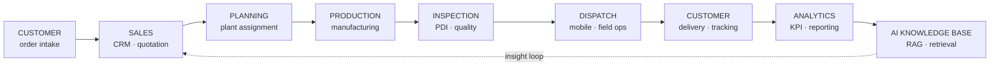
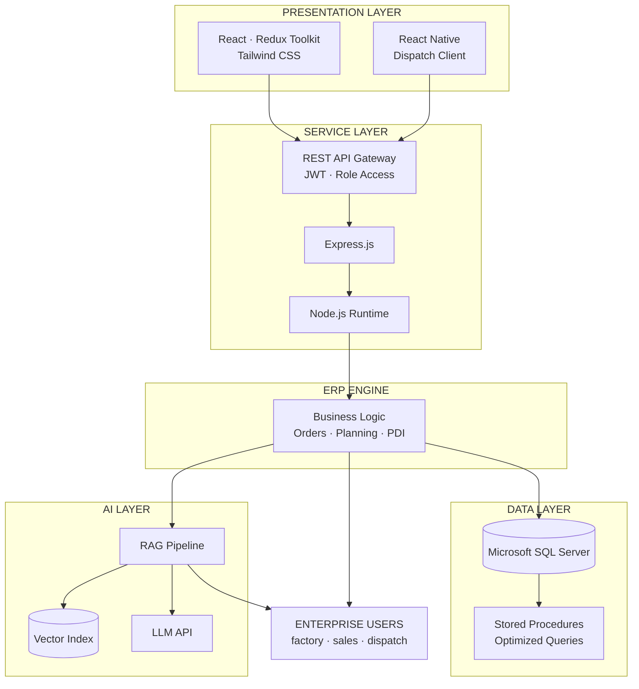
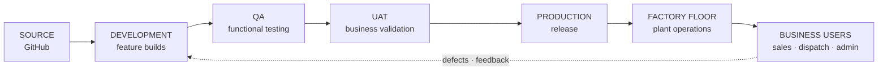

<!-- ══════════════════════════════════════════════════════════════
     ERP CONTROL CENTER · KAJA-IT
     Enterprise dashboard interface — dark industrial theme
     ══════════════════════════════════════════════════════════════ -->

<div align="center">


<!-- ── LIVE SYSTEM STATUS ── -->


<br/>

[](https://git.io/typing-svg)

</div>

<table width="100%">
<tr>
<td align="center" width="20%"><sub><b>OPERATOR</b></sub><br/><b>Kaja Moideen M K</b></td>
<td align="center" width="20%"><sub><b>ORGANIZATION</b></sub><br/><b>TVS Sundaram Industries</b></td>
<td align="center" width="20%"><sub><b>DEPARTMENT</b></sub><br/><b>IT · Enterprise Apps</b></td>
<td align="center" width="20%"><sub><b>ENVIRONMENT</b></sub><br/><b>PRODUCTION</b></td>
<td align="center" width="20%"><sub><b>LOCATION</b></sub><br/><b>Chennai, IN</b></td>
</tr>
</table>

<div align="center">


</div>


## SYSTEM INFORMATION

<table width="100%">
<tr>
<td width="50%" valign="top">

**OPERATOR PROFILE**

| Field | Value |
|:---|:---|
| Developer | Kaja Moideen M K |
| Position | React.js & Node.js Developer – AI Engineer |
| Organization | TVS Sundaram Industries Pvt Ltd |
| Department | Information Technology · Enterprise Applications |
| Experience | 2+ years · enterprise production systems |
| Domain | Tyre manufacturing · ERP · Analytics · AI |
| Deployment | Production — live factory operations |

</td>
<td width="50%" valign="top">

**PRIMARY RESPONSIBILITIES**

```console
[01]  ERP module development & maintenance
[02]  REST API integration · Redux state architecture
[03]  Analytics dashboards · KPI & reporting layer
[04]  RAG pipeline · AI assistant for ERP users
[05]  React Native dispatch application
[06]  SQL query optimization · large dataset tuning
[07]  Production debugging · cross-team delivery
```


</td>
</tr>
</table>


## ERP MODULE REGISTRY

<table width="100%">
<tr>
<td width="33%" valign="top">

**CRM**<br/>
 <br/>
<sub>Customer relationship management with lead tracking and account views.</sub><br/>
<sub>`React` `Redux` `SQL Server`</sub>

</td>
<td width="33%" valign="top">

**ORDER PROCESSING**<br/>
 <br/>
<sub>End-to-end order capture, validation, and fulfilment workflow.</sub><br/>
<sub>`React` `Node.js` `REST`</sub>

</td>
<td width="33%" valign="top">

**PLANT ASSIGNMENT**<br/>
 <br/>
<sub>Allocation of orders across manufacturing plants and capacity.</sub><br/>
<sub>`React` `SQL Server`</sub>

</td>
</tr>
<tr>
<td width="33%" valign="top">

**PRODUCTION PLANNING**<br/>
 <br/>
<sub>Production scheduling and tracking against demand.</sub><br/>
<sub>`React` `Redux` `REST`</sub>

</td>
<td width="33%" valign="top">

**PDI INSPECTION**<br/>
 <br/>
<sub>Pre-Dispatch Inspection with quality checkpoints and sign-off.</sub><br/>
<sub>`React` `Node.js`</sub>

</td>
<td width="33%" valign="top">

**PRICE SHEET**<br/>
 <br/>
<sub>Price sheet management with versioning and approval flow.</sub><br/>
<sub>`React` `SQL Server`</sub>

</td>
</tr>
<tr>
<td width="33%" valign="top">

**DISPATCH**<br/>
 <br/>
<sub>Real-time dispatch operations and field data capture.</sub><br/>
<sub>`React Native` `REST`</sub>

</td>
<td width="33%" valign="top">

**INVENTORY**<br/>
 <br/>
<sub>Stock visibility across plants and warehouses.</sub><br/>
<sub>`React` `SQL Server`</sub>

</td>
<td width="33%" valign="top">

**ANALYTICS DASHBOARD**<br/>
 <br/>
<sub>Charts, KPI cards, advanced filtering and reporting.</sub><br/>
<sub>`React` `Redux` `Charts`</sub>

</td>
</tr>
<tr>
<td width="33%" valign="top">

**CUSTOMER PORTAL**<br/>
 <br/>
<sub>Self-service ordering for tyres and rims with order tracking.</sub><br/>
<sub>`React` `Node.js` `SQL Server`</sub>

</td>
<td width="33%" valign="top">

**PRODUCT SALES**<br/>
 <br/>
<sub>Sales operations, process ID management and reporting.</sub><br/>
<sub>`React` `REST`</sub>

</td>
<td width="33%" valign="top">

**RAG AI ASSISTANT**<br/>
 <br/>
<sub>Retrieval-augmented document search and contextual answers.</sub><br/>
<sub>`RAG` `LLM APIs` `Node.js`</sub>

</td>
</tr>
</table>


## ENTERPRISE WORKFLOW




## SYSTEM ARCHITECTURE




## TECHNOLOGY STACK

<table width="100%">
<tr>
<td width="20%" valign="top">

**FRONTEND**

<br/>
<br/>
<br/>


</td>
<td width="20%" valign="top">

**BACKEND**

<br/>
<br/>
<br/>


</td>
<td width="20%" valign="top">

**DATABASE**

<br/>
<br/>
<br/>


</td>
<td width="20%" valign="top">

**AI LAYER**

<br/>
<br/>
<br/>


</td>
<td width="20%" valign="top">

**TOOLING**

<br/>
<br/>
<br/>


</td>
</tr>
</table>


## ENTERPRISE METRICS

<div align="center">

<table>
<tr>
<td align="center" width="25%"><br/><sub><b>ERP MODULES</b></sub></td>
<td align="center" width="25%"><br/><sub><b>YEARS IN PROD</b></sub></td>
<td align="center" width="25%"><br/><sub><b>AI PIPELINE LIVE</b></sub></td>
<td align="center" width="25%"><br/><sub><b>PLATFORMS</b></sub></td>
</tr>
<tr>
<td align="center" width="25%"><br/><sub><b>PRIMARY DATASTORE</b></sub></td>
<td align="center" width="25%"><br/><sub><b>INTEGRATION LAYER</b></sub></td>
<td align="center" width="25%"><br/><sub><b>REPORTING</b></sub></td>
<td align="center" width="25%"><br/><sub><b>FACTORY OPERATIONS</b></sub></td>
</tr>
</table>

<sub>Metrics reflect scope of systems under active development and maintenance.</sub>

</div>


## DEPLOYMENT PIPELINE




## REPOSITORY ACCESS POLICY

<table width="100%">
<tr>
<td width="8%" align="center"></td>
<td>

**RESTRICTED — ENTERPRISE INTELLECTUAL PROPERTY**

Source code for the systems described above is owned by TVS Sundaram Industries Pvt Ltd and hosted in private organization repositories. It cannot be published, mirrored, or shared.

What is shown here instead: system architecture, module inventory, workflow design, and technology decisions — the engineering, without the proprietary code.

Available on request during interviews: architecture walkthroughs, design rationale, technical deep-dives, and problem/solution discussion for any module listed.

For public code samples, see the personal account below.

</td>
</tr>
</table>


## SYSTEM TELEMETRY

<div align="center">


<br/>


<br/>


<br/>


**CONTRIBUTION TRACE**


<sub>Activity originates primarily from private and organization repositories. The graph reflects throughput, not source visibility.</sub>

</div>


## SUPPORT CENTER

<div align="center">

<sub>Technical discussion, architecture reviews, and engineering opportunities.</sub>

<br/>

[](https://github.com/KAJA-MOIDEEN)
[](https://github.com/KAJA-MOIDEEN/kaja-moideen-portfolio)
[](https://linkedin.com/in/kaja-moideen)
[](mailto:kajamoideen3100@gmail.com)

<br/>

[](https://git.io/typing-svg)

</div>


