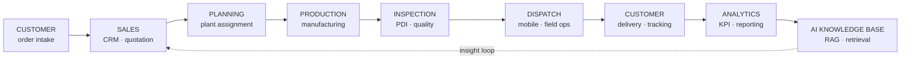
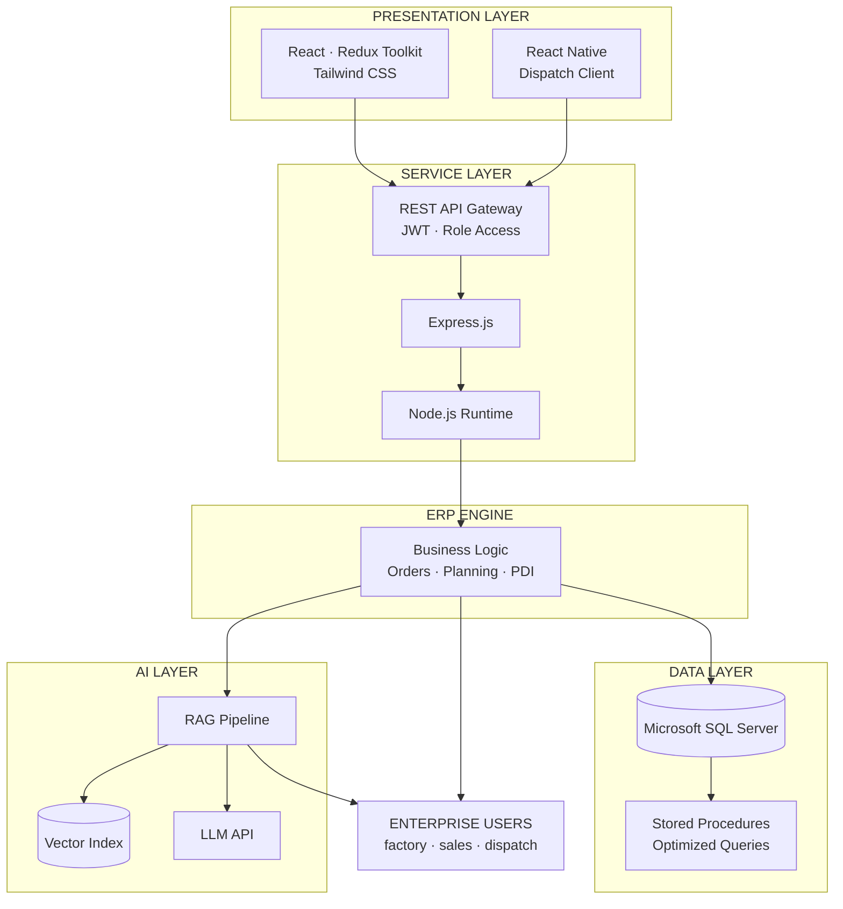
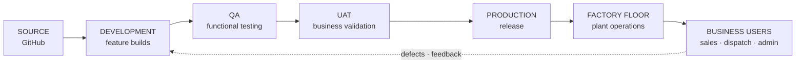

<!-- ══════════════════════════════════════════════════════════════
     KAJA MOIDEEN M K · ERP CONTROL CENTER
     Layout note: every table cell uses PURE HTML (<b>, <sub>,
     <code>, <br/>, ) — never markdown. This makes the
     layout immune to blank-line loss when copying.
     ══════════════════════════════════════════════════════════════ -->

<div align="center">


<h1>KAJA MOIDEEN M K</h1>

<h3>React.js &amp; Node.js Developer — AI Engineer</h3>

<p>


</p>

<p>


</p>

[](https://git.io/typing-svg)

<p>


</p>

</div>


## 01 · SYSTEM INFORMATION

<table width="100%">
<tr>
<td width="33%" align="left" valign="top">
<b>OPERATOR</b><br/>
<br/>
<sub>Kaja Moideen M K</sub><br/>
<sub>React.js &amp; Node.js Developer — AI Engineer</sub><br/><br/>
<sub><code>2+ years</code> <code>Production</code></sub>
</td>
<td width="33%" align="left" valign="top">
<b>ORGANIZATION</b><br/>
<br/>
<sub>TVS Sundaram Industries Pvt Ltd</sub><br/>
<sub>Information Technology · Enterprise Applications</sub><br/><br/>
<sub><code>Chennai, IN</code> <code>Since Mar 2025</code></sub>
</td>
<td width="33%" align="left" valign="top">
<b>DOMAIN</b><br/>
<br/>
<sub>Tyre manufacturing · ERP · Analytics · AI</sub><br/>
<sub>Live factory floor operations</sub><br/><br/>
<sub><code>Web</code> <code>Mobile</code> <code>AI</code></sub>
</td>
</tr>
</table>

**PRIMARY RESPONSIBILITIES**

```console
[01]  ERP module development & maintenance
[02]  REST API integration · Redux state architecture
[03]  Analytics dashboards · KPI & reporting layer
[04]  RAG pipeline · AI assistant for ERP users
[05]  React Native dispatch application
[06]  SQL query optimization · large dataset tuning
[07]  Production debugging · cross-team delivery
```


## 02 · ERP MODULE REGISTRY

<table width="100%">
<tr>
<td width="33%" align="left" valign="top">
<b>CRM</b><br/>
 <br/>
<sub>Customer relationship management with lead tracking and account views.</sub><br/><br/>
<sub><code>React</code> <code>Redux</code> <code>SQL Server</code></sub>
</td>
<td width="33%" align="left" valign="top">
<b>ORDER PROCESSING</b><br/>
 <br/>
<sub>End-to-end order capture, validation and fulfilment workflow.</sub><br/><br/>
<sub><code>React</code> <code>Node.js</code> <code>REST</code></sub>
</td>
<td width="33%" align="left" valign="top">
<b>PLANT ASSIGNMENT</b><br/>
 <br/>
<sub>Allocation of orders across manufacturing plants and capacity.</sub><br/><br/>
<sub><code>React</code> <code>SQL Server</code></sub>
</td>
</tr>
<tr>
<td width="33%" align="left" valign="top">
<b>PRODUCTION PLANNING</b><br/>
 <br/>
<sub>Production scheduling and tracking against live demand.</sub><br/><br/>
<sub><code>React</code> <code>Redux</code> <code>REST</code></sub>
</td>
<td width="33%" align="left" valign="top">
<b>PDI INSPECTION</b><br/>
 <br/>
<sub>Pre-Dispatch Inspection with quality checkpoints and sign-off.</sub><br/><br/>
<sub><code>React</code> <code>Node.js</code></sub>
</td>
<td width="33%" align="left" valign="top">
<b>PRICE SHEET</b><br/>
 <br/>
<sub>Price sheet management with versioning and approval flow.</sub><br/><br/>
<sub><code>React</code> <code>SQL Server</code></sub>
</td>
</tr>
<tr>
<td width="33%" align="left" valign="top">
<b>DISPATCH</b><br/>
 <br/>
<sub>Real-time dispatch operations and field data capture.</sub><br/><br/>
<sub><code>React Native</code> <code>REST</code></sub>
</td>
<td width="33%" align="left" valign="top">
<b>INVENTORY</b><br/>
 <br/>
<sub>Stock visibility across plants and warehouse locations.</sub><br/><br/>
<sub><code>React</code> <code>SQL Server</code></sub>
</td>
<td width="33%" align="left" valign="top">
<b>ANALYTICS DASHBOARD</b><br/>
 <br/>
<sub>Charts, KPI cards, advanced filtering and reporting.</sub><br/><br/>
<sub><code>React</code> <code>Redux</code> <code>Charts</code></sub>
</td>
</tr>
<tr>
<td width="33%" align="left" valign="top">
<b>CUSTOMER PORTAL</b><br/>
 <br/>
<sub>Self-service ordering for tyres and rims with order tracking.</sub><br/><br/>
<sub><code>React</code> <code>Node.js</code> <code>SQL Server</code></sub>
</td>
<td width="33%" align="left" valign="top">
<b>PRODUCT SALES</b><br/>
 <br/>
<sub>Sales operations, process ID management and reporting.</sub><br/><br/>
<sub><code>React</code> <code>REST</code></sub>
</td>
<td width="33%" align="left" valign="top">
<b>RAG AI ASSISTANT</b><br/>
 <br/>
<sub>Retrieval-augmented document search and contextual answers.</sub><br/><br/>
<sub><code>RAG</code> <code>LLM APIs</code> <code>Node.js</code></sub>
</td>
</tr>
</table>


## 03 · ENTERPRISE WORKFLOW




## 04 · SYSTEM ARCHITECTURE




## 05 · TECHNOLOGY STACK

<table width="100%">
<tr>
<td width="33%" align="left" valign="top">
<b>FRONTEND</b><br/>
<br/><br/>
<sub><code>React.js</code> <code>Redux Toolkit</code><br/><code>Tailwind CSS</code> <code>JavaScript ES6+</code></sub>
</td>
<td width="33%" align="left" valign="top">
<b>BACKEND</b><br/>
<br/><br/>
<sub><code>Node.js</code> <code>Express.js</code><br/><code>REST API</code> <code>JWT Auth</code></sub>
</td>
<td width="33%" align="left" valign="top">
<b>DATABASE</b><br/>
<br/><br/>
<sub><code>SQL Server</code> <code>Stored Procedures</code><br/><code>Query Optimization</code> <code>MongoDB</code></sub>
</td>
</tr>
<tr>
<td width="33%" align="left" valign="top">
<b>MOBILE</b><br/>
<br/><br/>
<sub><code>React Native</code> <code>Field Sync</code><br/><code>Offline Capture</code></sub>
</td>
<td width="33%" align="left" valign="top">
<b>AI LAYER</b><br/>
<br/><br/>
<sub><code>RAG</code> <code>LLM APIs</code><br/><code>Vector Search</code> <code>Prompt Engineering</code></sub>
</td>
<td width="33%" align="left" valign="top">
<b>TOOLING</b><br/>
<br/><br/>
<sub><code>Git</code> <code>GitHub</code><br/><code>VS Code</code> <code>Excel Import/Export</code></sub>
</td>
</tr>
</table>


## 06 · ENTERPRISE METRICS

<table width="100%">
<tr>
<td width="25%" align="center"><br/><sub><b>ERP MODULES</b></sub></td>
<td width="25%" align="center"><br/><sub><b>YEARS IN PRODUCTION</b></sub></td>
<td width="25%" align="center"><br/><sub><b>RAG AI PIPELINE</b></sub></td>
<td width="25%" align="center"><br/><sub><b>PLATFORMS</b></sub></td>
</tr>
<tr>
<td width="25%" align="center"><br/><sub><b>PRIMARY DATASTORE</b></sub></td>
<td width="25%" align="center"><br/><sub><b>INTEGRATION LAYER</b></sub></td>
<td width="25%" align="center"><br/><sub><b>REPORTING</b></sub></td>
<td width="25%" align="center"><br/><sub><b>FACTORY OPERATIONS</b></sub></td>
</tr>
</table>


## 07 · DEPLOYMENT PIPELINE




## 08 · REPOSITORY ACCESS POLICY

> **RESTRICTED — ENTERPRISE INTELLECTUAL PROPERTY**
>
> Source code for the systems above is owned by TVS Sundaram Industries Pvt Ltd and hosted in private organization repositories. It cannot be published, mirrored, or shared.
>
> Shown here instead: system architecture, module inventory, workflow design and technology decisions — the engineering, without the proprietary code.
>
> Available on request during interviews: architecture walkthroughs, design rationale and technical deep-dives for any module listed.
>
> For public code samples, see the personal account below.


## 09 · SYSTEM TELEMETRY

<div align="center">


<h3>CONTRIBUTION TRACE</h3>


<sub>Activity originates primarily from private and organization repositories. The graph reflects throughput, not source visibility.</sub>

</div>


## 10 · SUPPORT CENTER

<div align="center">

<sub>Technical discussion, architecture reviews and engineering opportunities.</sub>

<p>
<a href="https://github.com/KAJA-MOIDEEN"></a>
<a href="https://github.com/KAJA-MOIDEEN/kaja-moideen-portfolio"></a>
<a href="https://linkedin.com/in/kaja-moideen"></a>
<a href="mailto:kajamoideen3100@gmail.com"></a>
</p>

[](https://git.io/typing-svg)

</div>


